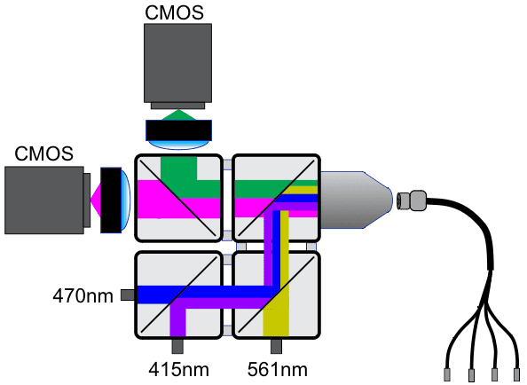

# FIP_DAQ_Control

[](LICENSE)

For FIP photometry data acquisition and hardware control.
Protocol for system assembly: https://www.protocols.io/view/modified-frame-projected-independent-fiber-photome-261ge39edl47/v2
Protocol for system triggering setup: https://www.protocols.io/view/modified-frame-projected-independent-fiber-photome-261ge39edl47/v2

# Fiber Photometry System Configuration

## Overview

The FIP (Frame-projected Independent Photometry) system is a low-cost, scalable photometry setup designed for chronic recording of optical signals from behaving mice during daily training. The system is based on a modified design of Frame-projected Independent Photometry (Kim et al., 2016), using inexpensive, commercially available, off-the-shelf components.



For more information, see the [AIND Fiber Photometry Platform Page](https://www.allenneuraldynamics.org/platforms/fiber-photometry)

## Wavelength Information

The table below summarizes the photometry system's optical configuration, showing the relationship between emission channels and their corresponding excitation sources.

<table>
  <tr>
    <th colspan="3">Excitation</th>
    <th style="border-left: 1px solid #ccc;"></th>
    <th colspan="3">Emission</th>
  </tr>
  <tr>
    <th>name</th>
    <th>wavelength</th>
    <th>led_name</th>
    <th style="border-left: 1px solid #ccc;"></th>
    <th>name</th>
    <th>wavelength</th>
    <th>detector_name</th>
  </tr>
  <tr>
    <td>yellow</td>
    <td>565</td>
    <td>565nm LED</td>
    <td style="border-left: 1px solid #ccc;"></td>
    <td>red</td>
    <td>?</td>
    <td>Red CMOS</td>
  </tr>
  <tr>
    <td>blue</td>
    <td>470</td>
    <td>470nm LED</td>
    <td style="border-left: 1px solid #ccc;"></td>
    <td>green</td>
    <td>?</td>
    <td>Green CMOS</td>
  </tr>
  <tr>
    <td>uv</td>
    <td>415</td>
    <td>415nm LED</td>
    <td style="border-left: 1px solid #ccc;"></td>
    <td>isosbestic</td>
    <td>?</td>
    <td>Green CMOS</td>
  </tr>
</table>

## Signal Detection

- **Green Channel**: Primarily used for green GFP based indicators
- **Red Channel**: Primarily used for RFP-based indicators (e.g., RdLight)
- **Isosbestic Channel**: Used as a control measurement; shares same emission path as green but with different excitation

The system uses dedicated CMOS cameras for the red and green emissions, with the isosbestic signal being captured by the green camera under different excitation conditions.

## Temporal Multiplexing

The system employs temporal multiplexing to acquire signals from multiple fluorescent indicators through the same optical fiber. This is achieved by rapidly cycling through different excitation wavelengths while synchronizing camera acquisitions:

```
Blue LED(470)   ████░░░░░░░░░░░████░░░░░░░░░░░████░░░░░░░░░░░████░░░░░░░░░░░████░░░░░░░░░░░

UV LED (415)    ░░░░░████░░░░░░░░░░░████░░░░░░░░░░░████░░░░░░░░░░░████░░░░░░░░░░░████░░░░░░

Yellow LED (560)░░░░░░░░░░████░░░░░░░░░░░████░░░░░░░░░░░████░░░░░░░░░░░████░░░░░░░░░░░████░

Green CMOS      ████░████░░░░░░████░████░░░░░░████░████░░░░░░████░████░░░░░░████░████░░░░░░  (captures 470/415)
Red CMOS        ░░░░░░░░░░████░░░░░░░░░░░████░░░░░░░░░░░████░░░░░░░░░░░████░░░░░░░░░░░████░  (captures 560)
                ───────────────────────────────────────────────────────────────────────────►
                                    Time
```

The temporal multiplexing sequence:
1. Blue LED (470nm) excitation -> Green CMOS camera captures signal from GFP-based sensors
2. UV LED (415nm) excitation -> Green CMOS camera captures isosbestic signal
3. Yellow LED (560nm) excitation -> Red CMOS camera captures signal from RFP-based sensors

This cycling occurs at 60 Hz (effectively 20 Hz per excitation channel), allowing near-simultaneous measurement of multiple signals while preventing crosstalk between channels. Each LED is activated in sequence and cameras are synchronized to capture data only during their respective LED's ON period.

## Installation
1. Arduino/Teensy
2. Bonsai:
	- To deploy the Bonsai code, run `./bonsai/setup.cmd`. This small script will download and regenerate the current bonsai environment ([see tutorial for further details.](https://bonsai-rx.org/docs/articles/environments.html))
	- Dependencies:
		- Windows 10 or 11
		- [Visual Studio Code](https://code.visualstudio.com/) (highly recommended for editing code scripts and git commits)
		- [Git for Windows](https://gitforwindows.org/) (highly recommended for cloning and manipulating this repository)
		- [.NET Framework 4.7.2 Developer Pack](https://dotnet.microsoft.com/download/dotnet-framework/thank-you/net472-developer-pack-offline-installer) (required for intellisense when editing code scripts)
		- [Visual C++ Redistributable for Visual Studio 2012](https://www.microsoft.com/en-us/download/details.aspx?id=30679) (native dependency for OpenCV)
		- [Spinnaker SDK 1.29.0.5](https://www.flir.co.uk/support/products/spinnaker-sdk/#Downloads) (device drivers for FLIR cameras)
		  - On FLIR website: `Download > archive > 1.29.0.5 > SpinnakerSDK_FULL_1.29.0.5_x64.exe`

3. Copy paste 4 CSV files in the LocalDependency folder to Users\svc_aind_behavior\Documents\FIPSettings and change the CameraSerial based on FLIR cameras used in the rig.

## Contributing
Describe how other software developers can contribute to the codebase.

